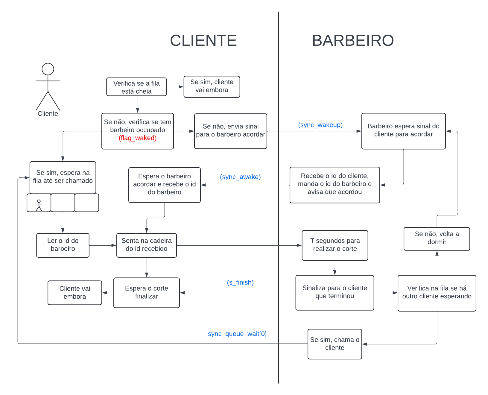

<h3>Projeto de Sistema em Tempo Real: Barbeiros dorminhocos </h3>

<b>Descrição:</b> Problema baseado no clássico problema do Barbeiro Dorminho proposto por Edsger Dijkstra - que envolve sincronização em sistemas operacionais e programação concorrente. O problema foi proposto para ilustrar o uso de semáforos na resolução de problemas de sincronização.

<b>Diagrama funcional:</b>

 
[Link do video no Youtube](https://youtu.be/zURhDanFUwM)

 

<h3> Real Time Systems: Sleeping Baber </h3>
<b>Description:</b> A problem based on the classic Sleeping Barber problem proposed by Edsger Dijkstra - which involves synchronization in operating systems and concurrent programming. The problem was proposed to illustrate the use of semaphores in solving synchronization problems.

<h4>Dependencies</h4>
<ul>
    <li> make
    <li> pthread
</ul>

